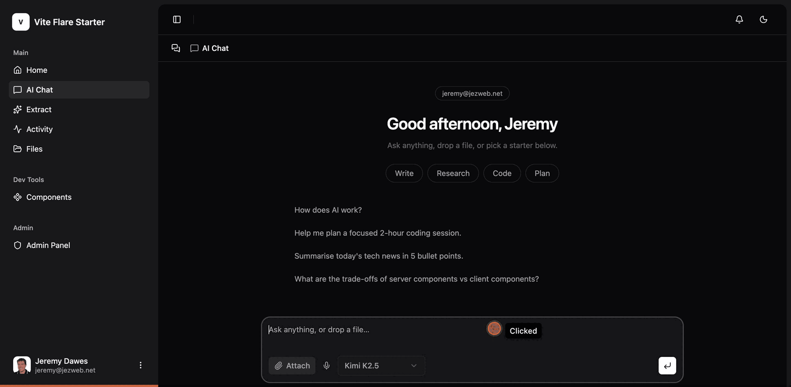
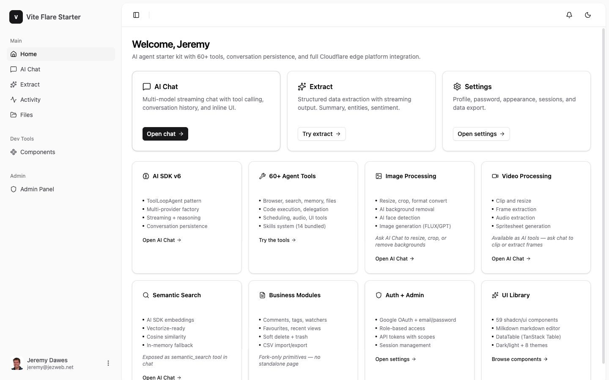
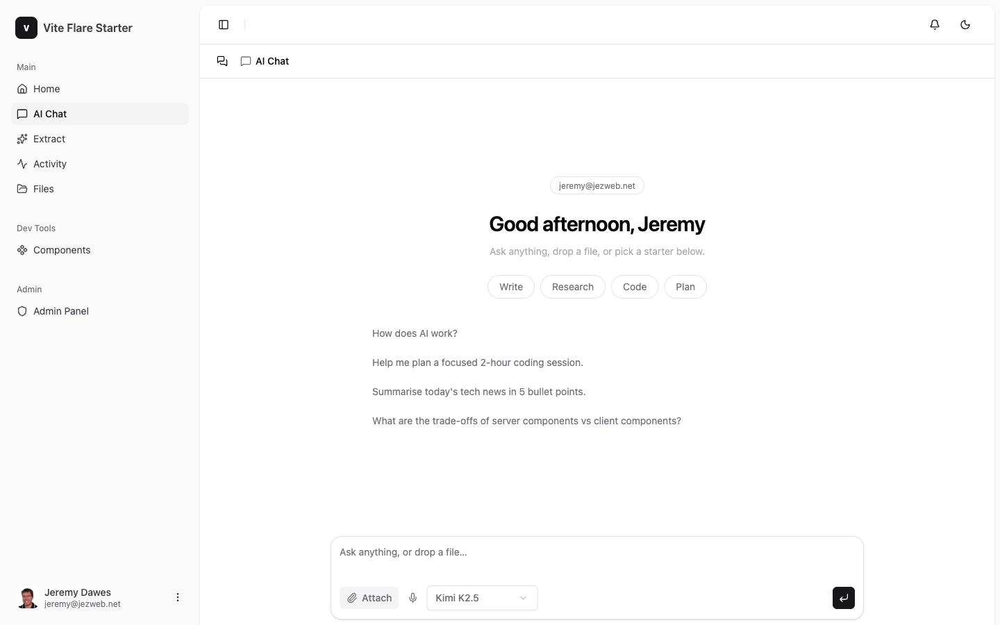
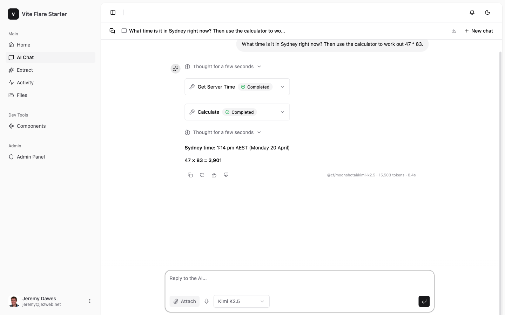
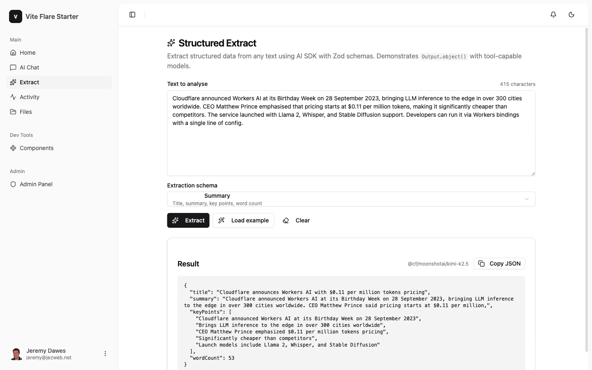
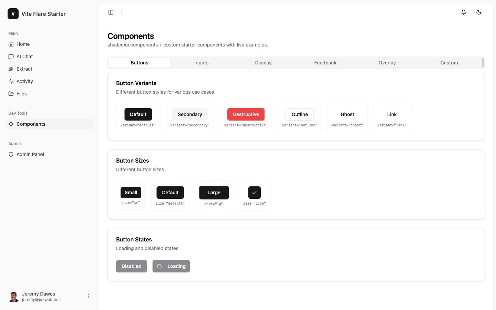
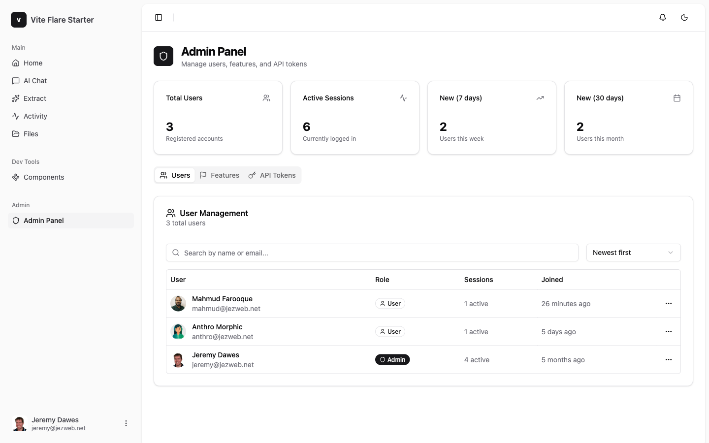
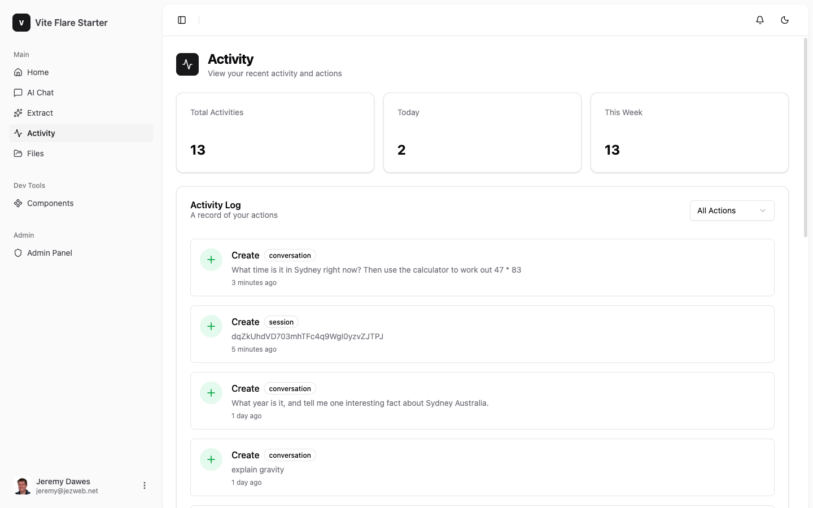
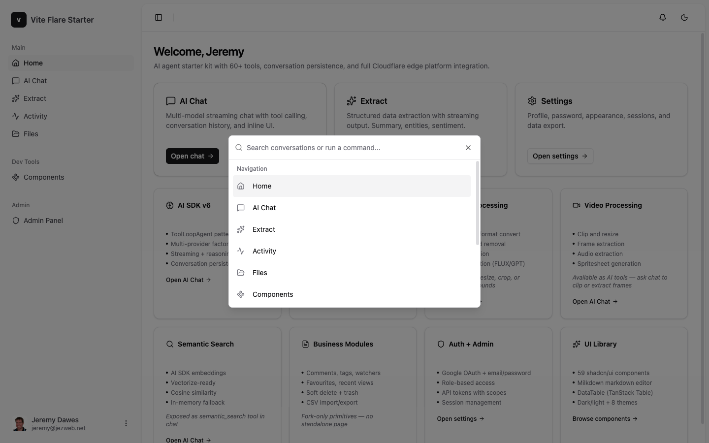

# Vite Flare Starter

**Production-ready AI agent starter kit for Cloudflare Workers.** Ship a conversational AI product with tool calling, skills, file uploads, and admin ops — built the way we build at Jezweb.

[](https://deploy.workers.cloudflare.com/?url=https://github.com/jezweb/vite-flare-starter)

**[Live Demo](https://vite-flare-starter.webfonts.workers.dev)** · **[Developer Guide](./CLAUDE.md)** · **[Forking Guide](./FORKING.md)**

---

## See it in action



One prompt, two tool calls (`get_server_time` + `calculate`), streamed response with reasoning, token + latency footer. This is the `ToolLoopAgent` pattern — every tool in the starter works the same way.

---

## Tour

| | |
|---|---|
|  | **Dashboard shell** — config-driven sidebar with role + feature-flag gating. Edit `nav.ts`, not layouts. |
|  | **AI Chat** — greeting by time of day, preset prompts, persisted conversations. 16 models across 8 providers. |
|  | **Agent loop in one turn** — tool chips, reasoning, streamed answer. Every call logs tokens and duration. |
|  | **Structured output** — upload a document, get JSON matching a Zod schema. Uses `env.AI.toMarkdown()` for PDFs. |
|  | **Components showcase** — a living pattern library of the UI primitives used throughout the app. |
|  | **Admin panel** — user + role management, stats, auto-promotion via `ADMIN_EMAILS`. |
|  | **Activity log** — audit trail with pagination, filters, and entity history. |
|  | **Cmd+K palette** — global search + navigation. Reads straight from the nav config. |

---

## What it gives you

**AI agent layer**

- `ToolLoopAgent` pattern (AI SDK v6) with `createAgentUIStreamResponse`
- 40+ tools across 11 modules — browser, search, memory, files, code execution, UI, audio, todo, delegation
- Skills system (Claude Agent Skills compatible) — bundled, R2, or GitHub sources
- Conversation persistence via `ChatStorage` interface (D1 today, DO-ready)
- Subagent delegation with role-based tool assignment
- Human-in-the-loop via `needsApproval` on destructive tools
- 16 models across 8 providers (Workers AI free tier + OpenRouter unlocks the rest)
- MCP integration (tools, resources, prompts, elicitation) + MCP-UI rendering

**Application framework**

- Auth — `better-auth` with Google OAuth (email/password optional)
- Admin — role-based access (user/manager/admin), auto-promotion via `ADMIN_EMAILS`
- Config-driven sidebar — add nav items in `nav.ts`, feature-flag modules in `features.ts`
- UI — Tailwind v4 + shadcn/ui, 8+ themes, dark/light/system
- Command palette — Cmd+K, keyboard shortcuts
- Files — R2 upload/download with D1 metadata
- Activity — audit log with pagination and entity history
- Notifications — in-app, unread counts
- API tokens — SHA-256 hashed, scope-based
- Feature flags — DB-backed with admin API

---

## Tech stack

| Layer | Technology |
|---|---|
| Platform | Cloudflare Workers with Static Assets |
| Frontend | React 19 + Vite 7 |
| Backend | Hono 4.12 |
| Database | D1 (SQLite) + Drizzle ORM 0.45 |
| Auth | better-auth 1.6 |
| AI | AI SDK v6 + workers-ai-provider + OpenRouter |
| UI | Tailwind v4 + shadcn/ui |
| Data | TanStack Query 5 + `apiClient` |
| Forms | React Hook Form + Zod |
| Testing | Vitest 4 + `@cloudflare/vitest-pool-workers` |

---

## Quick start

```bash
git clone https://github.com/jezweb/vite-flare-starter.git my-app
cd my-app
pnpm install

pnpm cf:login
npx wrangler d1 create my-app-db       # copy database_id into wrangler.jsonc
npx wrangler r2 bucket create my-app-avatars
npx wrangler r2 bucket create my-app-files

cp .dev.vars.example .dev.vars         # fill in BETTER_AUTH_SECRET, Google OAuth creds
pnpm db:migrate:local
pnpm dev
```

Open [http://localhost:5173](http://localhost:5173) and sign in.

---

## Agent toolkit

Tools live in `src/server/modules/chat/tools/` and are auto-included based on available bindings.

| Module | Tools | Requires |
|---|---|---|
| core | `get_server_time`, `get_model_info`, `calculate` | Always |
| memory | `remember`, `recall`, `search_memory`, `forget` | Always |
| ui | 11 inline UI components (choices, alerts, tables, timelines, progress, comparison, confirm, metrics, contact, collect, ask) | Always |
| skills | `load_skill` | Always |
| todo | `todo_add`, `todo_update`, `todo_list`, `todo_clear` | Always |
| delegate | `delegate` (role-based subagent spawn) | Always |
| audio | `transcribe_audio`, `speak_text` | Always (AI binding) |
| code | `run_python`, `run_shell`, `run_js` | `SANDBOX` DO binding |
| browser | `browser_markdown`, `browser_extract`, `browser_screenshot`, `browser_links`, `browser_content` | CF API token |
| search | `web_search` | One of Serper / Brave / Tavily / Exa key |
| files | `fs_list`, `fs_read`, `fs_write`, `fs_delete` | `FILES` R2 bucket |

Adding a tool: create a file in `tools/`, export `buildXxxTools(ctx)`, register in `tools/index.ts`. Bind-aware factories mean you can't accidentally ship a tool for a service that isn't configured.

---

## Skills

Claude Agent Skills compatible — same SKILL.md format as Claude Code, Cursor, Hermes, OpenClaw, Aider.

```
skills/
  web-research/SKILL.md
  draft-email/SKILL.md
  code-review/SKILL.md
  extract-structured-data/SKILL.md
  ...12 total
```

Progressive disclosure: only names + descriptions are in the system prompt. The full body loads on demand via `load_skill`. Register more skills from GitHub URLs or R2 uploads at runtime.

---

## Multi-provider AI

One `resolveModel()` call picks the right provider from the model string.

```typescript
resolveModel(env, '@cf/moonshotai/kimi-k2.5')        // Workers AI — free
resolveModel(env, 'claude-sonnet-4-6')                // Anthropic
resolveModel(env, 'gpt-5.4-mini')                     // OpenAI
resolveModel(env, 'gemini-3.1-pro')                   // Google
resolveModel(env, 'openrouter/deepseek/deepseek-v3.2') // OpenRouter
```

Model catalogue is a bundled snapshot from [models.flared.au](https://models.flared.au). Refresh with `pnpm models:refresh`.

---

## Deployment

```bash
printf "secret" | npx wrangler secret put BETTER_AUTH_SECRET
printf "https://your-app.workers.dev" | npx wrangler secret put BETTER_AUTH_URL
printf "http://localhost:5173,https://your-app.workers.dev" | npx wrangler secret put TRUSTED_ORIGINS

pnpm db:migrate:remote
npx wrangler deploy
```

Always use `printf` not `echo` — `echo` appends a newline that breaks HMAC signatures.

---

## Commands

| Command | Does |
|---|---|
| `pnpm dev` | Local dev server |
| `pnpm build` | Production build |
| `npx wrangler deploy` | Deploy to Cloudflare |
| `pnpm db:generate:named "x"` | Create a new Drizzle migration |
| `pnpm db:migrate:local` | Apply migrations to local D1 |
| `pnpm db:migrate:remote` | Apply migrations to production D1 |
| `pnpm models:refresh` | Refresh the bundled AI model catalogue |
| `pnpm test` | Run tests |
| `pnpm type-check` | Strict TypeScript check |

---

## Philosophy

This is a **pattern library**, not a demo.

Every module teaches one technique for this stack — ToolLoopAgent, D1-first storage, R2 uploads, feature flags, audit logging, OAuth on Workers, MCP integration. When you build a new feature in a fork, read the closest existing module first.

Don't delete modules you don't need. Disable them via `src/shared/config/features.ts` — the code stays as a reference. Future-you, or the next AI agent working in the fork, will thank you.

---

## Documentation

- **[CLAUDE.md](./CLAUDE.md)** — Developer context: architecture, patterns, how to build features
- **[FORKING.md](./FORKING.md)** — Step-by-step guide for starting a new product from this base

---

MIT — see [LICENSE](./LICENSE).
